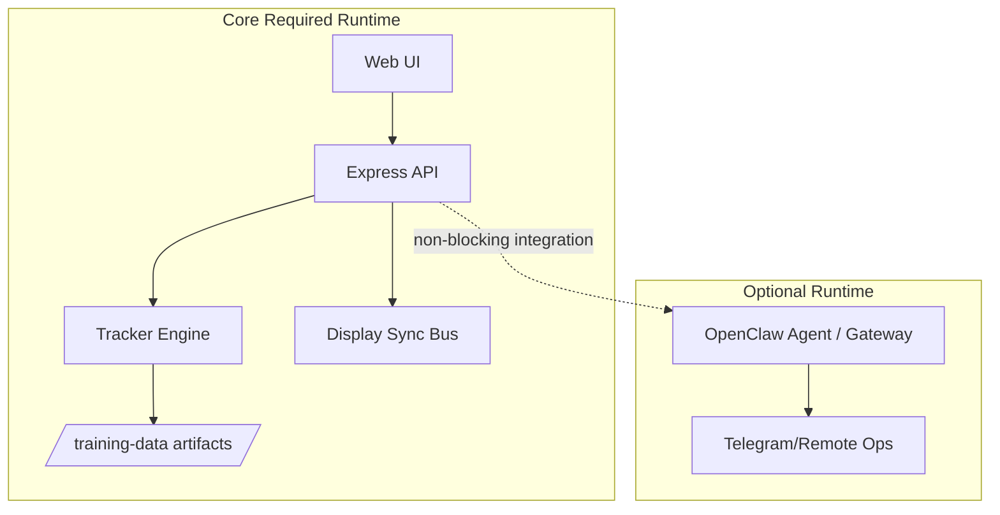

# Liturgy Project Architecture Visualization

## Current Runtime (as built)

```mermaid
flowchart LR
  U[End User] --> UI[Web UI /client]
  UI --> API[Express API /server]

  API --> LT[LiturgyPageTracker\n/api/liturgy/*]
  API --> BUS[Display Bus\n/api/control/*]
  API --> DB[(Postgres / storage)]
  API --> FILES[/uploads + /training-data/]

  UI --> AGENTAPI[/api/agent/*]
  AGENTAPI --> AGENT[OpenClaw Agent :29789]

  LT --> TD[/training-data/*.json]
  AGENT --> SKILLS[armenian-learner + other skills]
```

## Target Architecture (final direction)



## Design Rules
1. **Core page turning must work without agent.**
2. **Agent failures must not block app start or live mode.**
3. **Tracker tuning via env config, not source edits.**
4. **One install health-check script required before release.**
